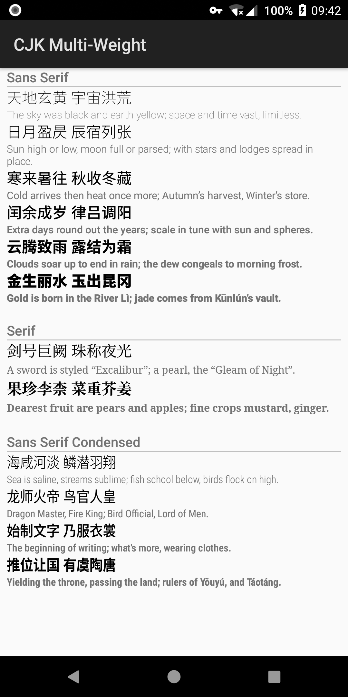
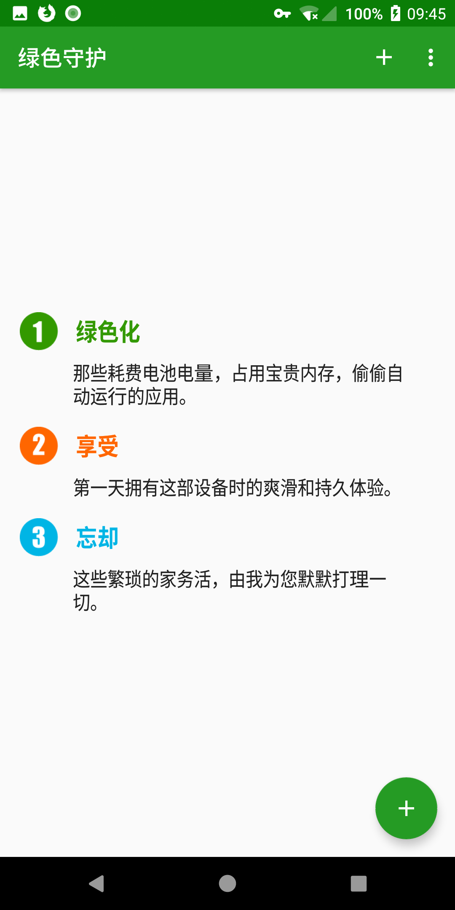
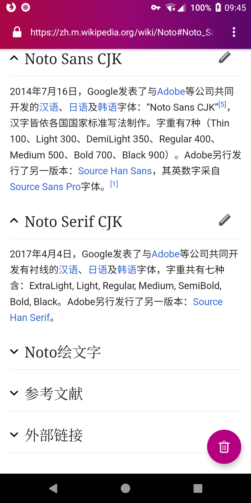

# Chinese (Simplified) Font Completion 简体中文完整字体包

Complete Chinese (Simplified) font, including multi-weight Sans Serif, Serif, and Sans Serif Condensed, for Android N and O devices.

适用于 Android N 和 O 的简体中文完整字体包，包含 Sans Serif、Serif、Sans Serif Condensed 三个字族以及多个字重。

## What does this module provide? 这个模块包含哪些东西？

+ Add CJK Ideograph, Kana, and Hangul to Roboto (6 weights, Roman/Italic)
+ Add CJK Ideograph, Kana, and Hangul to Roboto Condensed (4 weights, Roman/Italic)
+ Add CJK Ideograph, Kana, and Hangul to Noto Serif (Regular/Bold, Roman/Italic)
+ Provide Noto Sans CJK JP/KR/SC/TC (6 weights)

+ 为 Roboto 补全汉字、假名、谚文（6 字重，正斜体均有）
+ 为 Roboto Condensed 补全汉字、假名、谚文（4 字重，正斜体均有）
+ 为 Noto Serif 补全汉字、假名、谚文（常规和粗体，正斜体均有）
+ 还有 Noto Sans CJK JP/KR/SC/TC (6 字重)

## Preview 预览

### Multi-family, multi-weight 多字族，多字重

### Clean and clear, catch the point at first glance 多字重带来清晰的信息层级划分

### Condensed makes up Android Design 字体的宽度变化，展现 Material Design 的魅力

### Serif on Web 完美还原网页上的宋体字

## Changelog

### 2.138-2

+ Fix kerning.
+ Rename `Roboto-*.ttc` to `Roboto-*.ttf` to shadow stock `Roboto-*.ttf` files. Apps with embedded font engine should work properly.

### 2.138-1

+ Initial release.

## Credit

These fonts are based on [Roboto](https://github.com/google/roboto), [Noto Fonts](https://github.com/googlei18n/noto-fonts), and [Noto CJK](https://github.com/googlei18n/noto-cjk); generating script can be found [here](https://github.com/CyanoHao/android-chinesesimplified-font-completion-generator).

Thanks to simonsmh and his [NotoSansCJK (Nougat&Oreo)](https://github.com/Magisk-Modules-Repo/magisk-notosanscjk-nougat). This module is based on his work.

## Notice for License

Although original Roboto fonts are licensed under Apache, the fonts included in this module are licensed under OFL.
